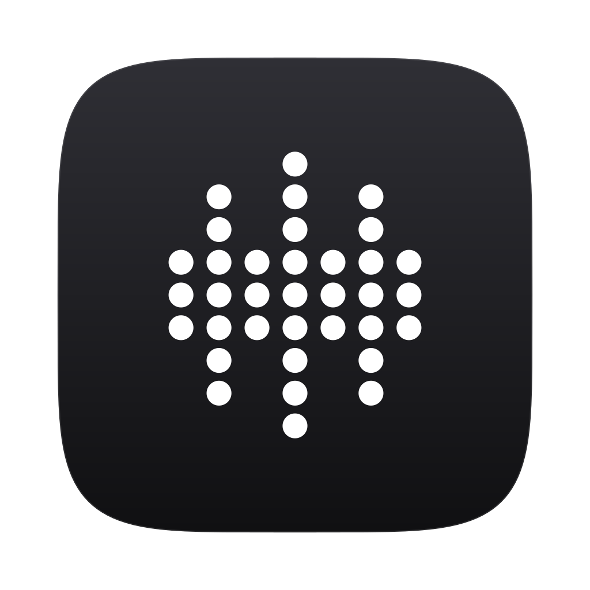
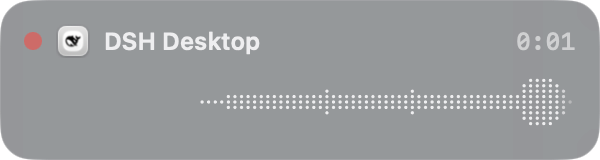
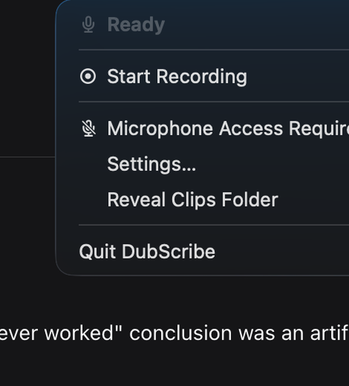

<p align="center">
  <a href="https://github.com/dangercharlie/DubScribe/releases"></a>
  <a href="https://github.com/dangercharlie/DubScribe"></a>
  <a href="https://github.com/dangercharlie/homebrew-tap"></a>
  <a href="https://github.com/dangercharlie/DubScribe"></a>
  <a href="LICENSE"></a>
</p>

<p align="center">
  
</p>

<p align="center">
  <strong>0.7.0</strong> — a new dot-matrix icon, and a rebuilt interface to go with it.
</p>

---

**DubScribe** is a small macOS utility for low-friction audio capture.

> Shortcut → record → paste

Hold a key, say the thing, release. The clip lands on your clipboard as a WAV,
ready to paste — no editor, no library, no save dialog, no file hunting.

It lives in your menu bar. There is no window and no Dock icon, so there is
nothing to switch to: the app is wherever you already are.

<p align="center">
  
</p>

<p align="center">
  
  &nbsp;&nbsp;&nbsp;
  
</p>

---

## Install

Download the latest `.dmg` from [Releases](https://github.com/dangercharlie/DubScribe/releases)
and drag **DubScribe** to your Applications folder. Or:

```bash
brew install --cask dangercharlie/tap/dubscribe
```

DubScribe is unsigned, so macOS may need a nudge the first time — right-click the
app and choose **Open**, or clear the quarantine flag:

```bash
xattr -dr com.apple.quarantine /Applications/DubScribe.app
```

## Use

1. Launch it. A short welcome shows where the app lives and what to press.
2. **Hold `⌃⌥Space`** to record, and release to stop. Or **press `⌃⌥R`** to start
   and stop. Both are rebindable in Settings.
3. **`⌘V`** wherever the clip belongs.

macOS asks for microphone access the first time you record, not at launch.

Everything else lives in the menu bar icon: your last clip, the settings you
change while working, the clips folder, and Settings itself.

## Features

- **Two ways to record.** Hold a key, or press once to start and again to stop.
- **Straight to the clipboard.** Every clip is a WAV, copied the moment you stop.
- **A level indicator while recording** — what you are capturing, the live input
  as a dot-matrix waveform, and how long you have been going.
- **Re-copy the last clip** without recording it again.
- **Microphone selection**, with a test panel and live level guide.
- **Optional media handling.** Pause other playback and mute system audio for the
  length of a recording, then put it all back.
- **Clips clean up after themselves** — see below.

Shortcuts use Carbon (`RegisterEventHotKey`), and pausing media uses MediaRemote,
the same channel the keyboard's media keys use — so **DubScribe never asks for
Accessibility permission**.

## Clips clean up after themselves

Clips are temporary by default, because DubScribe is for getting audio onto your
clipboard rather than building a library. **A clip is never deleted while it is on
the clipboard**, however long it stays there. The folder is kept within a size
budget (250 MB by default), oldest clips first, and anything removed goes to the
Trash where *Put Back* still works. There is no timer, so a clip is only removed
when the folder needs the room. The budget is configurable, and the whole
behaviour can be turned off.

## Privacy

Offline and self-contained: no network calls, no telemetry, no account, and the
microphone is live only while you are recording.

## Accessibility

Native SwiftUI controls, labelled icon buttons, human-readable slider values, and
decorative elements hidden from VoiceOver. Feedback from VoiceOver, keyboard-only
and neurodivergent users is very welcome.

## What's new in 0.7.0

Mostly a rebuild of how the app looks and behaves.

- **Menu-bar only.** The main window and Dock icon are gone. The settings you
  reach for mid-task moved into the menu, where they are checkmarks on the same
  state Settings edits.
- **A new app icon** — dot matrix at the sizes where it reads, a simpler mark
  below that.
- **A rebuilt Settings window** — three tabs (General, Recording, Storage), native
  controls, and copy that explains itself.
- **A level indicator**, the most visible addition. Frosted, monochrome, drawn as
  a dot matrix, and adjustable from fully opaque to barely there.
- **Self-deleting clips.** A size budget, no timer, and a clip on the clipboard is
  never deleted.
- **A welcome window on first launch**, and a short What's New after an update.
- **No Accessibility permission.** Pausing media now goes through the same channel
  as the keyboard's media keys.
- **Voice activation is gone.** It was unreliable and held Bluetooth headsets in
  low-quality call mode. The microphone now opens only on demand.
- **Fixed along the way:** the start cue no longer lands at the head of every
  recording, Bluetooth headsets are released properly, shortcut labels show real
  key names, and a decoding bug that could silently reset your preferences is gone.

## Fixed since 0.7.0

Two bug-fix releases, no new features.

- **0.7.1** — with *Pause media while recording* on and nothing playing, finishing
  a recording could open Apple Music. Pausing now checks that another app is
  actually producing sound before it sends anything.
- **0.7.2** — with Chrome open, one unresponsive browser tab could stall the media
  controller: QuickTime never paused, and nothing resumed afterwards for the rest
  of the session. Apple Events calls now time out, and pausing runs before the
  browser tab search rather than after it.

Full detail in [CHANGELOG.md](CHANGELOG.md).

## Requirements

macOS 13 or later, Apple Silicon, microphone access.

## About

DubScribe is a vibe-coded experiment that turned into a tool I use every day. It
began from one line:

> Make a simple macOS app where a hotkey records a short WAV clip and
> automatically copies it to the clipboard.

The first release was written with ChatGPT for the product brief and Claude for
the implementation. **0.7.0 was built in conjunction with DeepSeek 4.1 Flash**.

It is an early release. The audio and hotkey paths are stable; expect rough edges
around unusual hardware and future macOS updates.

## License

MIT.

## Support

☕️ [Buy Me a Coffee](https://ko-fi.com/dangercharlie)
