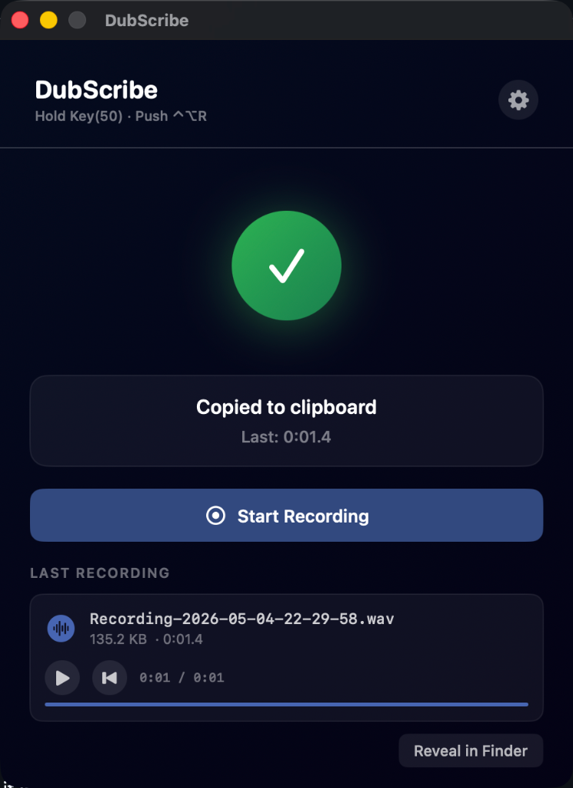
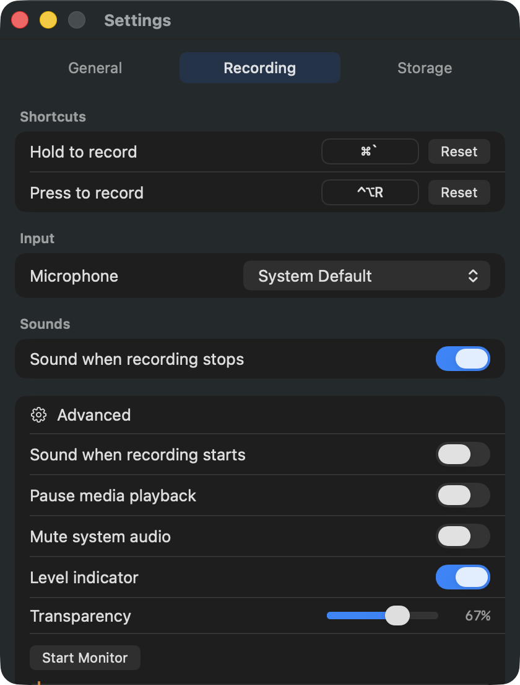

  
   
  
  

**DubScribe** is a tiny macOS utility for quickly recording short WAV audio clips and copying them straight to the clipboard.

The core workflow is simple:

> Press a hotkey → speak → release/stop → WAV is copied to the clipboard → paste with `Cmd + V`

It is designed for moments when you do not want to open a full audio editor, manage a voice memo library, export a file manually, or transcribe your voice into text. DubScribe is for capturing the actual audio clip as a pasteable file.

  
  &nbsp;&nbsp;&nbsp;
  

---

## Why?

macOS has several ways to record audio, but most are built around longer recordings, manual saving, or transcription.

DubScribe solves a narrower problem:

- I want to record a very short voice/audio clip.
- I want it saved as a `.wav`.
- I want it immediately on the clipboard.
- I want to paste it somewhere with `Cmd + V`.
- I do not want to hunt through folders, export menus, or drag files around.

Think of it like a screenshot tool, but for quick WAV audio snippets.

---

## Features

- Native macOS app
- Apple Silicon focused
- Built with Xcode
- Records short WAV audio clips
- Copies the finished WAV file to the clipboard automatically
- Global hotkey recording (Uses Carbon APIs — no annoying Accessibility permissions required!)
- Push-to-record and hold-to-record style workflows
- Menu bar utility design
- Last recording preview/playback
- Reveal last recording in Finder
- Input source selection
- Voice activation support
- Mic test / input feedback
- Launch at login
- Minimal keyboard accessibility support

---

## Installation

1. Download the latest `.dmg` from the [Releases](https://github.com/dangercharlie/DubScribe/releases) page.
2. Open the `.dmg` and drag **DubScribe** to your `Applications` folder.
3. Launch DubScribe. *(Note: Since this is an unsigned indie app, you may need to Right-Click -> Open the first time, or allow it in System Settings -> Privacy & Security).*

---

## Basic Usage

1. Launch **DubScribe**.
2. Grant microphone permission when prompted.
3. Set your preferred recording hotkeys in Settings.
4. Press your recording hotkey.
5. Speak for a few seconds.
6. Stop or release the hotkey.
7. DubScribe saves the clip as a WAV and copies it to the clipboard.
8. Press `Cmd + V` in a compatible app or folder to paste the WAV file.

---

## Recording Modes

DubScribe supports multiple quick recording styles:

### Hold to Record

Hold the configured shortcut to record.  
Release the shortcut to stop recording and copy the WAV to the clipboard.

### Push to Record

Press the configured shortcut once to start recording.  
Press it again to stop recording and copy the WAV to the clipboard.

### Voice Activation

DubScribe can listen for input above a configurable threshold and automatically record when speech is detected.

The threshold slider helps avoid accidental recordings from background noise.

---

## How It Compares

DubScribe is intentionally small and specific.

### Apple Voice Memos

Voice Memos is great for longer personal recordings, but it is not built around hotkey-triggered capture or instant WAV-to-clipboard workflows.

### QuickTime / traditional recorders

Traditional macOS recording tools can capture audio, but usually require opening an app, starting a recording manually, saving/exporting, and then locating the file.

### Dictation and speech-to-text apps

Many modern Mac voice tools focus on turning speech into text and pasting the transcription. DubScribe keeps the original audio as a WAV file instead.

### Larger media capture tools

Some broader tools can record audio, video, screenshots, and copy media to the clipboard. DubScribe is deliberately simpler: it focuses only on quick microphone WAV capture.

---

## Requirements

- macOS
- Apple Silicon Mac
- Microphone access

---

## Privacy & Security

DubScribe is a local-only utility designed for maximum transparency.

✅ **100% Offline:** Zero internet connections, no cloud sync, and no APIs.  
✅ **Local Storage:** Files are written straight to your local sandbox (`~/Library/Containers/`).  
✅ **Blind Hotkeys:** Uses Carbon APIs (`RegisterEventHotKey`) so it doesn't need invasive Accessibility permissions to monitor your keyboard.  
❌ **No AI Models:** Zero speech-to-text or semantic processing. "Voice Activation" just mathematically measures microphone volume.  
❌ **No Telemetry:** Zero crash reporters or product analytics.  
❌ **No Keylogging:** It only responds to the exact shortcut you configure.  

---

## Development Notes

DubScribe was created as a small native macOS app experiment using Xcode and AI-assisted development.

Initial product brief and iteration prompts were written with ChatGPT.  
The working app was generated and refined in Antigravity using Claude Sonnet 4.6.

The goal was to see whether a focused native utility could be built quickly from a clear product brief:

> Make a simple macOS app where a hotkey records a short WAV clip and automatically copies it to the clipboard.

---

## Status

Early release.

The core audio and hotkey systems are stable, but expect some rough edges around edge-case hardware or future macOS updates.

---

## License

DubScribe is released under the MIT License.

---

## Support

If you find DubScribe useful, consider buying me a coffee!  
☕️ [Buy Me A Coffee](https://ko-fi.com/dangercharlie)
